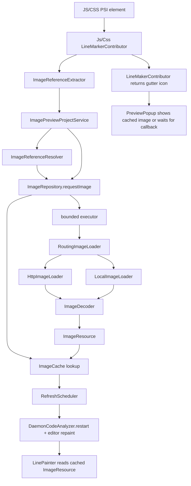

# image-preview 技术方案

## 1. 项目定位

`image-preview` 是一个 JetBrains IDE 插件，用于在 JS/TS/CSS 文件中识别远程图片 URL 和本地图片路径，并在编辑器内提供两类能力：

- 行标记图标：点击后弹出图片预览。
- 行尾提示：图片加载完成后，在图片 URL 所在行展示宽、高和资源大小。

当前插件支持 `http` / `https` 图片 URL、`file://` URI、绝对路径和相对路径。相对路径会按当前 JS/TS/CSS 文件所在目录解析。支持的图片后缀包括 `jpg`、`jpeg`、`png`、`gif`、`bmp`、`webp`、`svg`。

## 2. 技术栈与运行环境

- 语言：Kotlin
- 构建：Gradle Kotlin DSL
- IDE 插件框架：IntelliJ Platform Gradle Plugin 2.x
- 目标平台：GoLand 2026.1，平台 build `261.*`
- 运行依赖：JavaScript 插件、CSS 插件
- 测试框架：JUnit 5 / kotlin-test
- CI：GitHub Actions

本地构建需要使用 Java 17 或更高版本运行 Gradle。仓库 CI 已经配置为 Java 17。

## 3. 目录结构

```text
src/main/kotlin/com/github/gllxl/imagepreview/
  CssLineMarkerContributor.kt         CSS url(...) 入口
  JsLineMarkerContributor.kt          JS/TS 变量入口
  LineMakerContributor.kt             gutter icon 与 Preview action
  LinePainter.kt                      行尾图片尺寸展示
  Utils.kt                            URL 判断、文本属性、文件大小格式化

  extractor/
    ImageReferenceExtractor.kt        URL 提取接口
    JsImageReferenceExtractor.kt      JS/TS PSI URL 提取
    CssImageReferenceExtractor.kt     CSS PSI URL 提取

  model/
    ImageReference.kt                 文件、行号、URL 引用模型
    ImageResource.kt                  已解码图片资源模型
    ImageLoadState.kt                 图片加载状态模型

  service/
    ImagePreviewProjectService.kt     Project 级服务门面
    ImageReferenceResolver.kt         远程 URL / 本地路径解析
    ImageReferenceStore.kt            VirtualFile + line -> URL 映射
    ImageRepository.kt                图片请求、缓存命中、并发去重、失败退避
    ImageCache.kt                     LRU 图片缓存
    ImageLoader.kt                    HTTP / 本地文件加载与大小保护
    ImageDecoder.kt                   栅格图和 SVG 解码
    RefreshScheduler.kt               daemon restart 与 editor repaint

  dto/ImageDTO.kt                     兼容旧命名的 typealias
  ui/PreviewPopup.kt                  图片弹窗
  ui/Icon.kt                          行标记图标加载

src/main/resources/
  META-INF/plugin.xml                 插件声明、扩展点、projectService 注册
  images/image.svg                    行标记图标
  messages/MyBundle.properties        国际化资源

src/test/kotlin/com/github/gllxl/imagepreview/
  Utils.kt                            URL、引号、文件大小工具函数测试
  ImageCacheTest.kt                   LRU 缓存测试
  ImageDecoderTest.kt                 SVG / 栅格图解码测试
  ImageReferenceResolverTest.kt       远程 URL / 本地路径解析测试
  LocalImageLoaderTest.kt             本地图片加载测试
  ImageReferenceStoreTest.kt          行映射行为测试
  ImageRepositoryTest.kt              异步加载、缓存、并发、失败退避测试

docs/
  TECHNICAL_SOLUTION.md               技术方案文档
```

## 4. 总体架构

插件现在按“提取、模型、服务、UI”分层，避免 editor highlighting / line painter 路径直接持有网络下载、图片解码和缓存细节。



核心原则：

- UI 层只做轻量判断、缓存读取和动作注册。
- 网络 IO、本地文件读取、字节读取、图片解码都只在后台 executor 中执行。
- 项目级状态由 `ImagePreviewProjectService` 持有，避免跨项目缓存和行映射互相污染。
- 加载失败进入短期退避窗口，避免坏 URL 或弱网下反复排队请求。

## 5. 图片引用识别与登记

入口在 `JsLineMarkerContributor` 和 `CssLineMarkerContributor`。它们不直接解析复杂规则，而是委托给 `extractor` 层：

- `JsImageReferenceExtractor`：针对 `JSVariable`，取变量节点最后一个子节点文本，再移除包裹引号。
- `CssImageReferenceExtractor`：针对 `CSS_URI`，在子节点中寻找 `CSS_STRING` 或 `CSS_TERM -> CSS_STRING`。

远程 URL 判断由 `isImageUrl()` 完成，使用 `URI` 解析而不是简单正则：

- 只接受 `http` / `https`。
- 根据 path 最后一段的扩展名判断图片类型。
- 支持 query string 和 fragment，例如 `logo.PNG?v=1#hero`。
- 避免 `not-an-imagejpg` 这类没有真实扩展名的误判。

本地图片判断由 `isImageReference()` 和 `ImageReferenceResolver` 完成：

- 支持 `file:///path/to/logo.png`。
- 支持 `/absolute/path/to/logo.png`。
- 支持 `./assets/logo.png` 和 `../shared/icon.svg`。
- 相对路径优先按当前文件所在目录解析，缺少当前文件目录时才使用项目根目录。
- resolver 只做路径规范化，不同步访问文件系统；文件是否存在、是否可读、是否超过大小上限由后台 `LocalImageLoader` 判断。

识别成功后，contributor 将 `(VirtualFile, lineNumber, resolvedSource)` 写入 `ImageReferenceStore`，再返回 gutter 标记。远程 source 保留原 URL，本地 source 规范化为 `file://` URI，方便缓存和加载复用。

## 6. 行映射

`ImageReferenceStore` 维护：

```text
WeakHashMap<VirtualFile, MutableMap<Int, String>>
```

设计要点：

- key 使用 `VirtualFile`，同名不同文件不会互相污染。
- 行号使用 `Int`，避免装箱对象比较导致误删。
- 同一 URL 允许出现在多个行号上。
- 非图片引用会清除当前行已有映射，降低编辑后残留错误提示的概率。
- 外层使用 `WeakHashMap`，减少文件关闭后的长期持有风险。
- store 由 project service 持有，每个项目独立。

## 7. 图片加载、缓存与失败退避

`ImageRepository` 是运行时核心协调器。它负责：

- 校验图片引用。
- 查询 `ImageCache`。
- 合并同一 URL 的并发请求，避免重复下载。
- 将后台加载提交到有界 executor。
- 维护失败退避窗口。
- 加载成功后触发 callback 和编辑器刷新。

缓存由 `ImageCache` 提供：

```text
LinkedHashMap<String, ImageResource>(accessOrder = true)
```

当前最多缓存 100 张图片，超过后淘汰最久未访问项。缓存对象 `ImageResource` 包含：

- `sourceUrl`
- `previewImage`
- `imageSize`
- `byteSize`
- `contentType`
- `originalWidth`
- `originalHeight`

加载流程：

1. `requestImage(source)` 先判断图片引用是否支持。
2. 如果处在失败退避窗口，直接返回。
3. 如果缓存命中，直接回调。
4. 如果 URL 正在加载，将 callback 合并到等待队列。
5. 如果 URL 未加载，提交到最多 3 并发的 executor。
6. `RoutingImageLoader` 根据 source 类型分派给 `HttpImageLoader` 或 `LocalImageLoader`。
7. 远程图片通过 `HttpRequests` 请求；响应为 HTTP 200 时先检查 `Content-Length`，超过 10 MB 的图片会跳过预览。
8. 本地图片通过 `Files` 读取；文件不存在、不可读或超过 10 MB 时跳过预览。
9. 读取响应体或本地文件时使用大小上限保护，避免未知长度响应或异常文件占用过多内存。
10. `ImageDecoder` 解码字节并生成 `ImageResource`。
11. 加载成功后写入 LRU cache。
12. 回到 IDE application event queue 后执行 callback，并由 `RefreshScheduler` 触发 daemon restart / editor repaint。

失败处理：

- 非 200 响应返回空。
- 本地文件不存在、不可读或超过大小上限返回空。
- 无法解码的图片返回空。
- `IOException` 和 `RuntimeException` 被捕获并记录 warn 日志。
- 失败不会写入缓存。
- 失败 URL 会记录失败时间，默认 60 秒内不重复请求，避免弱网或坏链接导致持续排队。

## 8. 图片解码与 SVG 策略

`ImageDecoder` 负责根据图片引用扩展名和 `Content-Type` 选择解码方式：

- SVG：source path 扩展名为 `svg`，或 `Content-Type` 为 `image/svg+xml`。
- 栅格图：使用 `ImageIO.read()` 解码。

SVG 处理策略：

- 使用 Batik 渲染 SVG，避免依赖 IntelliJ 平台内部 SVG API。
- 预览图最大边长限制为 1024px，防止超大 SVG 生成巨大 `BufferedImage`。
- `ImageResource.originalWidth/originalHeight` 保留 SVG 原始尺寸，`previewImage` 可以是缩放后的预览图。

栅格图处理策略：

- `ImageIO.read()` 返回 `null` 时视为无法解码。
- 解码异常不会冒泡到 IDE UI 路径。
- 当前还没有对超大栅格图生成缩略图，后续可在 `ImageDecoder` 中继续扩展。

## 9. 行标记、预览和行尾展示

`LineMakerContributor` 不执行同步下载。它只做：

- 验证图片引用。
- 通过 project service 触发异步预加载。
- 返回 gutter icon 和 Preview action。

点击 Preview 时：

- 如果缓存里已有图片，立即展示。
- 如果图片还没加载完成，注册 callback，加载完成后展示。

`LinePainter` 只读取缓存：

- 没有行映射：返回 `emptyList()`。
- 有行映射但图片未加载：触发异步请求并返回 `emptyList()`。
- 图片已加载：展示 `originalWidth * originalHeight (imageSize)`。

因此行标记和行尾绘制都不会阻塞，也不会在弱网时卡住编辑器输入或滚动。

## 10. 测试方案

当前测试重点覆盖纯逻辑、并发缓存、失败退避、远程/本地加载和解码行为，避免真实网络和完整 IDE UI。

`UtilsTest`

- 支持的图片 URL。
- 支持的本地图片引用。
- query / fragment / 大小写扩展名。
- 不支持协议和非图片路径。
- 引号移除。
- 文件大小格式化。

`ImageReferenceStoreTest`

- 同一行 URL 可更新。
- 同一 URL 可出现在多行。
- 非图片 URL 会清除当前行映射。
- 不同 `VirtualFile` 映射互相隔离。
- `clear()` 能清空映射。

`ImageCacheTest`

- LRU 淘汰规则。
- `clear()` 能清空缓存。

`ImageDecoderTest`

- SVG 字节可以渲染为 `BufferedImage`。
- URL 不是 `.svg` 时仍能根据 `Content-Type` 解码 SVG。
- `file://` SVG 可以按扩展名解码。
- 超大 SVG 预览会缩放，但保留原始尺寸。
- PNG 等栅格图走 `ImageIO`。
- 无效图片字节返回 `null`。

`ImageReferenceResolverTest`

- 远程 URL 原样保留。
- `file://`、绝对路径、相对路径都能解析为规范化 `file://` URI。
- 相对路径优先按当前文件目录解析，也支持项目根目录兜底。
- 缺失文件、非图片路径和协议相对 URL 会被忽略。

`LocalImageLoaderTest`

- 能从 `file://` URI 加载本地 PNG。
- 能从绝对路径加载本地 PNG。
- 缺失文件和超过大小上限的文件返回空。

`ImageRepositoryTest`

- `requestImage()` 会异步加载并写入缓存。
- 并发请求同一 URL 只触发一次 fetch，并扇出多个 callback。
- 缓存命中不会再次 fetch。
- 加载失败不会写缓存，退避窗口后可重试。
- loader 异常会被捕获并记录失败状态。
- 多 URL 加载遵守最多 3 并发。
- 非法 URL 在进入 fetch 前被忽略。

测试可控性：

- `ImageRepository` 通过构造参数注入 `ImageLoader`、executor、clock 和 UI dispatcher。
- 单测使用内存 `BufferedImage` 和本地固定线程池，不依赖外网。
- 并发测试用 `CountDownLatch` 明确控制加载时序。

建议继续补充：

1. PSI fixture 测试：构造 JS/TS/CSS 文件，验证 contributor 能识别真实语法节点。
2. CSS URL 解析测试：覆盖 `url("...")`、`url('...')`、`url(...)`、多 background 场景。
3. JS 解析测试：覆盖 `const`、`let`、对象属性、模板字符串和非 URL 变量。
4. UI 行为测试：在 IDE sandbox 中验证 gutter icon、popup 和行尾 repaint。

## 11. 构建与验证

IDEA / GoLand 中运行 `.run/Run IDE with Plugin.run.xml` 时，Gradle JVM 必须是 Java 17 或更高版本。项目已在 `.idea/gradle.xml` 中将 Gradle JVM 指向 `temurin-17`；如果本机仍报 “This build uses a Java 11 JVM”，需要在 IDE 中执行：

1. 打开 `Settings | Build, Execution, Deployment | Build Tools | Gradle`。
2. 将 `Gradle JVM` 设置为 `temurin-17`、其他 Java 17+ SDK，或选择 `Download JDK` 下载 17/21。
3. Reload All Gradle Projects 后重新运行 `Run Plugin`。

本地如果已经有平台包缓存，可以使用：

```bash
JAVA_HOME=/path/to/jdk17 ./gradlew test \
  -PlocalIdePath=/path/to/GoLand-2026.1
```

完整构建：

```bash
JAVA_HOME=/path/to/jdk17 ./gradlew check buildPlugin \
  -PlocalIdePath=/path/to/GoLand-2026.1
```

不传 `localIdePath` 时，Gradle 会根据 `gradle.properties` 下载配置的平台版本。这更适合 CI，但首次本地运行会比较慢。

常用任务：

```bash
./gradlew test
./gradlew check
./gradlew buildPlugin
./gradlew verifyPlugin
./gradlew runIde
```

## 12. CI 与发布

`Build` workflow 主要步骤：

1. checkout 代码。
2. 校验 Gradle Wrapper。
3. 设置 Java 17。
4. 执行 `./gradlew check`。
5. 执行 `./gradlew verifyPlugin`。
6. 执行 `./gradlew buildPlugin`。
7. 上传构建产物。
8. 生成 draft release。

`Release` workflow 在 GitHub release 发布后执行：

1. checkout release tag。
2. 设置 Java 17。
3. 按 release note patch changelog。
4. 执行 `publishPlugin`。
5. 上传 release asset。
6. 创建 changelog 更新 PR。

Dependabot 跟踪 `main` 分支，覆盖 Gradle 和 GitHub Actions 依赖。

## 13. 扩展指南

### 13.1 新增语言支持

新增语言一般需要：

1. 实现新的 `ImageReferenceExtractor`。
2. 增加新的 `RunLineMarkerContributor`。
3. 从对应语言 PSI 节点中提取候选 URL。
4. 调用 `imagePreviewService(project).references.setLineMapping(file, line, url)`。
5. 调用 `getLineMaker(url, project)`。
6. 在 `plugin.xml` 注册新的 `runLineMarkerContributor`。
7. 增加对应 PSI fixture 测试。

### 13.2 扩展更多图片来源

当前已经支持远程 URL 和本地文件路径。后续如果要支持更多来源，例如项目别名路径、Webpack/Vite alias、npm 包内资源或 data URI，建议继续沿用现在的分层：

- `ImageReferenceExtractor` 只从 PSI 提取原始文本。
- `ImageReferenceResolver` 负责把原始文本解析为稳定 source。
- `RoutingImageLoader` 根据 source 类型选择具体 loader。
- `ImageDecoder` 只处理字节到 `ImageResource`。

### 13.3 缓存策略升级

当前缓存按张数限制。后续如果遇到大图内存压力，可以改为：

- 按总像素数限制。
- 按估算字节数限制。
- 对超大栅格图按比例生成预览缩略图，进一步降低内存占用。

## 14. 已知限制

- 当前支持远程 URL、`file://` URI、绝对路径和相对路径；暂不支持 Web alias 路径（如 `@/assets/logo.png`）和 data URI。
- JS 识别仍主要围绕变量节点，复杂表达式支持有限。
- CSS 识别依赖 element type 文本，后续可替换为更稳定的 CSS PSI API。
- 行映射会在重新识别到非图片 URL 时清除当前行，但还没有完整的文件变更监听来批量清理旧行。
- UI popup 还没有对超大栅格图片自动缩放；SVG 预览已限制最大边长。

## 15. 质量门禁建议

建议合并前至少执行：

```bash
./gradlew test
./gradlew check
./gradlew buildPlugin
```

如果改动涉及插件兼容性或扩展点，应额外执行：

```bash
./gradlew verifyPlugin
```

如果改动涉及行标记、popup 或 editor repaint，建议在 `runIde` sandbox 中手动验证：

- JS/TS URL 是否出现 gutter icon。
- CSS `url(...)` 是否出现 gutter icon。
- 点击 icon 是否能弹出图片。
- 图片加载完成后行尾尺寸是否出现。
- 慢网或坏 URL 是否不会卡住编辑器。
